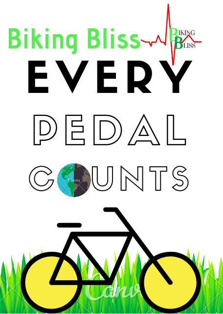

# Biking Bliss

**Biking Bliss** is an app to promote biking by providing features such as seamless bike-rack search, finding/reporting lost bikes and panels to access global biking rules. It was built using the MIT App Inventor as a submission to the Technovation Challenge 2019. 

Download it from [Play Store](https://play.google.com/store/apps/details?id=appinventor.ai_kreativekoalas.BikingBliss) and check out the [demo](https://www.youtube.com/watch?v=_C49YG164po) and [pitch](https://www.youtube.com/watch?v=p12Zk8cvXQ4) videos to know more about the app!

Refer to the [flowchart](images/bikingbliss_flowchart.png) to see the logic for showing biking-routes.

## Team members (in alphabetical order of the first name):
- Adhara Collins, The Sincere
- Iris Osborne, The Seamless
- Manvi Sharma, The Perfectionist
- Maya Their, The Witty
- Ruhi Gill, The Supernatural

## Mentor:
- [Gaurav Sahu](https://github.com/demfier)
